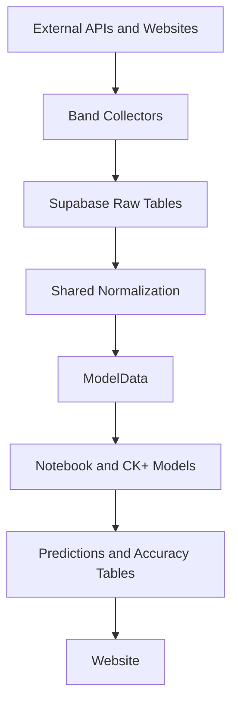

# Architecture Overview

This document provides the high-level system view. For the canonical ingestion,
storage, sequencing, and prediction contract, use the
[Data Strategy](../../reference/specifications/data_strategy.md) document.

## Overview

JamBandNerd is a show-centric data platform for jam band setlist collection,
normalization, prediction, and evaluation. The public product target is a
website-first experience backed by Supabase and the consolidated Python
pipeline.

## System Flow

## Layers

### Collection

- Band-specific collectors handle source quirks and write to raw tables.
- The standard raw families are `{band}_shows_raw`, `{band}_setlists_raw`, and
  `{band}_songs_raw`.
- Supporting tables such as venues or upcoming shows are allowed when the
  source requires them.
- WSP remains a special-case collector because CI reliability can require
  browser automation.

### Normalization and Transformations

- Shared code does not model directly from source-specific raw payloads.
- The normalization boundary in `scripts/common.py` and
  `src/jambandnerd/transformations/gaps.py` aligns bands onto a shared contract.
- Historical ordering is deterministic: `show_date` first, then a stable
  secondary key.
- All downstream feature generation remains in memory; no intermediate
  transformed Supabase tables are allowed.

### Models and Evaluation

- `ModelData` is the canonical handoff from transforms into models.
- Notebook and CK+ both rely on the same ordered historical show sequence and
  the same `reference_date` anti-leakage rule.
- `accuracy_per_show` is the granular evaluation source; aggregate accuracy
  tables are derived summaries.

### Delivery

- The website in `apps/web` is the target public surface.
- Supabase remains the shared storage and read layer for predictions and
  accuracy data.
- The Streamlit app remains a legacy transition surface only.

### Orchestration

- `scripts/run_optimized_pipeline.py` is the canonical end-to-end local runner.
- GitHub Actions executes the daily pipeline in production-like automation.
- Band discovery is partially dynamic today: automation can discover collector
  scripts, while some local entrypoints still maintain explicit supported-band
  lists.

## Non-Negotiable Rules

- Shared prediction code must remain band-agnostic.
- Collector-specific logic belongs in the collector and config layers.
- `reference_date` must gate all transforms and backtests.
- New data architecture work must preserve the two-stage contract:
  source-faithful raw storage, shared normalized modeling inputs.
