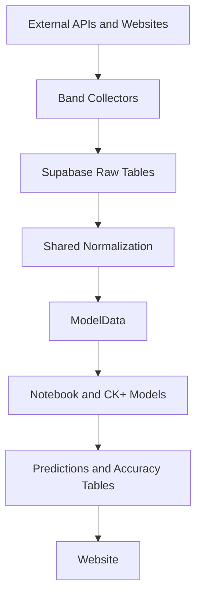

# Architecture Overview

This document provides the high-level system view. For the canonical ingestion,
storage, sequencing, and prediction contract, use the
[Data Strategy](../../reference/specifications/data_strategy.md) document.

## Overview

JamBandNerd is a show-centric data platform for jam band setlist collection,
normalization, prediction, and evaluation. The public product target is a
website-first experience backed by Supabase and the consolidated Python
pipeline.

## System Flow

## Layers

### Collection

- Band-specific collectors handle source quirks and write to raw tables.
- The standard raw families are `{band}_shows_raw`, `{band}_setlists_raw`, and
  `{band}_songs_raw`.
- Supporting tables such as venues or upcoming shows are allowed when the
  source requires them.
- WSP remains a special-case collector because CI reliability can require
  browser automation.

### Normalization and Transformations

- Shared code does not model directly from source-specific raw payloads.
- The normalization boundary in `scripts/common.py` and
  `src/jambandnerd/transformations/gaps.py` aligns bands onto a shared contract.
- Historical ordering is deterministic: `show_date` first, then a stable
  secondary key.
- All downstream feature generation remains in memory; no intermediate
  transformed Supabase tables are allowed.

### Models and Evaluation

- `ModelData` is the canonical handoff from transforms into models.
- Notebook and CK+ both rely on the same ordered historical show sequence and
  the same `reference_date` anti-leakage rule.
- `accuracy_per_show` is the granular evaluation source; aggregate accuracy
  tables are derived summaries.

### Delivery

- The website in `apps/web` is the current public surface.
- Supabase remains the shared storage and read layer for predictions and
  accuracy data.
- Streamlit has been retired and is not part of the active delivery path.

Current website routes:
- `/` - Homepage with band overview and upcoming shows
- `/predictions` - Live predictions with model comparison and show outlook
- `/performance` - Historical accuracy charts with K-value selection
- `/compare` - Model board comparison against actual setlists
- `/replay` - Historical prediction replay (last 50 shows per band/model)
- `/explorer` - Song and setlist analytics
- `/last-show` - Most recent completed show details
- `/_venues` - Venue analytics and tour patterns
- `/about`, `/contact`, `/data-use` - Public informational pages

Key shared components:
- `page-hero`, `site-header`, `site-footer`, `dashboard-side-nav`
- `prediction-hero`, `song-board`, `recall-chart`, `accuracy-table`
- `show-outlook-popover`, `live-tracker`, `model-agreement`, `venue-analytics`

### Orchestration

- `scripts/run_optimized_pipeline.py` is the canonical end-to-end local runner.
- GitHub Actions executes the daily pipeline in production-like automation.
- Band metadata (slug, display name, raw table names, ID column) is managed in the
  `bands` Supabase table as the single write point. The website reads it dynamically;
  adding a new band requires only inserting a row into `bands` and creating a collector.
- Supported bands: Goose, Phish, Eggy, Billy Strings, Widespread Panic, Umphrey's McGee

### Model Platform

New prediction models are added through a documented 4-step process (see
`docs/contributor/model_development.md`). Each model:
1. Inherits `PredictionModel` and consumes the same `ModelData` contract
2. Is wired into `generate_predictions.py` with its own output formatting block
3. Registers its version string and legacy table name in the config modules
4. Adds an entry to `MODEL_CONFIG` in the website for UI display

All models write to `prediction_songs` via `replace_prediction_projection()`, making
them automatically available to the website's analytics and explorer routes.

## Non-Negotiable Rules

- Shared prediction code must remain band-agnostic.
- Collector-specific logic belongs in the collector and config layers.
- `reference_date` must gate all transforms and backtests.
- New data architecture work must preserve the two-stage contract:
  source-faithful raw storage, shared normalized modeling inputs.
- Band metadata lives in the `bands` Supabase table — the website reads it
  dynamically. Do not hardcode band lists in frontend code.
- Models are wired via `MODEL_CONFIG` in the website and config modules — no
  dynamic discovery required on the frontend.
