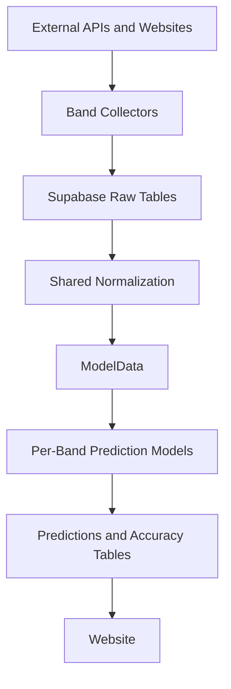

# Architecture Overview

This document provides the high-level system view. For the canonical ingestion,
storage, sequencing, and prediction contract, use the
[Data Strategy](../../reference/specifications/data_strategy.md) document.

## Overview

JamBandNerd is a show-centric data platform for jam band setlist collection,
normalization, prediction, and evaluation. The public product target is a
website-first experience backed by Supabase and the consolidated Python
pipeline.

## System Flow

## Layers

### Collection

- Band-specific collectors handle source quirks and write to raw tables.
- The standard raw families are `{band}_shows_raw`, `{band}_setlists_raw`, and
  `{band}_songs_raw`.
- Supporting tables such as venues or upcoming shows are allowed when the
  source requires them.
- WSP remains a special-case collector because CI reliability can require
  browser automation.

### Normalization and Transformations

- Shared code does not model directly from source-specific raw payloads.
- The normalization boundary in `scripts/common.py` and
  `src/jambandnerd/transformations/gaps.py` aligns bands onto a shared contract.
- Historical ordering is deterministic: `show_date` first, then a stable
  secondary key.
- All downstream feature generation remains in memory; no intermediate
  transformed Supabase tables are allowed.

### Models and Evaluation

> **Branch note (feat/single-model-per-band)**: This branch is transitioning
> from multi-model (Notebook/Deal per band) to one precision-optimized model per
> band. See `docs/contributor/adr/0001-single-model-per-band.md`. Legacy tables
> continue serving `main`/`dev` until cutover.

- `ModelData` is the canonical handoff from transforms into models. It remains
  shared across all band models.
- The target architecture has **one promoted model per band**. Each band's
  predictor class lives under `src/jambandnerd/models/{band}/` and implements
  the `PredictionModel` ABC. Architectures may differ across bands.
- All models respect the `reference_date` anti-leakage rule.
- **Primary metric**: precision@25 (top-25 predicted ∩ actual setlist, averaged
  across shows). Secondary: weighted average of precision@10/@25/@50.
- `setlist_accuracy` is the target canonical evaluation table, keyed
  `(band, model_version, target_show_key)`, retained to the last 50 eligible
  completed shows per band.
- Legacy tables (`completed_show_accuracy`, `accuracy_per_show`) remain
  canonical on `main`/`dev` until new tables are fully populated and validated.

### Delivery

- The website in `apps/web` is the current public surface.
- Supabase remains the shared storage and read layer for predictions and
  accuracy data.
- `apps/web/src/lib/data.ts` remains the compatibility import surface while domain ownership is split across `apps/web/src/lib/data/{bands,predictions,accuracy,replay,shows,venues}.ts`.
- Route files should compose server-side results rather than reimplement query logic.
- Client components are reserved for interactive islands, navigation hooks, and live subscriptions.

Current website routes (target state for this branch):
- `/` - Homepage with band overview and upcoming shows
- `/predictions` - Live single-model prediction board with show outlook
- `/performance` - Historical accuracy charts with K-value selection
- `/last-show` - Most recent completed show details
- `/about`, `/contact`, `/data-use` - Public informational pages

Removed from multi-model era (not present on this branch):
- `/compare` - Model board comparison (removed; no longer two models to compare)
- `/replay` - Side-by-side historical replay (removed; collapses to single board)
- `/explorer` - Compatibility redirect to `/replay` (removed with `/replay`)

Key shared components:
- `page-hero`, `site-header`, `site-footer`, `dashboard-side-nav`
- `prediction-hero`, `song-board`, `recall-chart`, `accuracy-table`
- `show-outlook-popover`, `live-tracker`, `model-agreement`

### Orchestration

- GitHub Actions YAML is the canonical daily orchestration surface.
- `scripts/run_optimized_pipeline.py` is a local helper that mirrors the daily
  workflow sequence for repo-supported bands.
- Pull requests targeting `main` should clear `Repo Quality` and `Verify Website` before merge.
- Workflow band support is repo-authoritative via `src/jambandnerd/config/bands.py`.
- Band metadata (slug, display name, raw table names, ID column) is managed in the
  `bands` Supabase table for runtime consumers such as the website. Adding a
  new band requires both updating the repo band config and inserting a row into
  `bands`.
- Supported bands: Goose, Phish, Eggy, Billy Strings, Widespread Panic, Umphrey's McGee

### Model Platform

> **Branch note (feat/single-model-per-band)**: The model platform is being
> redesigned on this branch. See `docs/contributor/adr/0001-single-model-per-band.md`.
> The description below reflects the **target architecture**.

The backend model platform is registry-based. The canonical source of truth is
`src/jambandnerd/models/registry.py`, keyed by **band slug** — one registered
model per supported band. Each entry carries `band`, `model_version`, lifecycle
flags, and `default_top_k`.

Per-band predictor classes live under `src/jambandnerd/models/{band}/` and
implement `PredictionModel` from `src/jambandnerd/models/base.py`. Legacy
multi-model classes (Notebook, Deal, CK+) are retained in
`src/jambandnerd/models/legacy/` for offline backtest comparison until
per-band models exceed their precision@25 over ≥50 historical shows.

Adding or updating a per-band model:
1. Implement `PredictionModel` in `src/jambandnerd/models/{band}/model.py`.
2. Update the band's registry entry with a new `model_version`.
3. Run `scripts/run_backtest.py --band {band}` and compare against legacy
   baselines via `scripts/compare_to_legacy_baselines.py --band {band}`.
4. Promote once the per-band gate is met (see ADR 0001).

Live model runs write to `setlist_predictions` and `setlist_prediction_songs`.
Completed-show evaluation writes to `setlist_results` and `setlist_accuracy`.

## Non-Negotiable Rules

- **Shared infra stays band-agnostic**: `ModelData`, `PredictionModel` ABC,
  training/eval harness, storage contract, and CI scaffolding are shared.
  Per-band predictor classes belong in `src/jambandnerd/models/{band}/`.
- Collector-specific logic belongs in the collector and config layers.
- `reference_date` must gate all transforms and backtests.
- New data architecture work must preserve the two-stage contract:
  source-faithful raw storage, shared normalized modeling inputs.
- Band metadata lives in the `bands` Supabase table — the website reads it
  dynamically. Do not hardcode band lists in frontend code.
- Backend model registration lives in `models/registry.py`. There is no
  frontend model-picker config — `MODEL_CONFIG` and `ACTIVE_MODELS` are
  removed on this branch.
