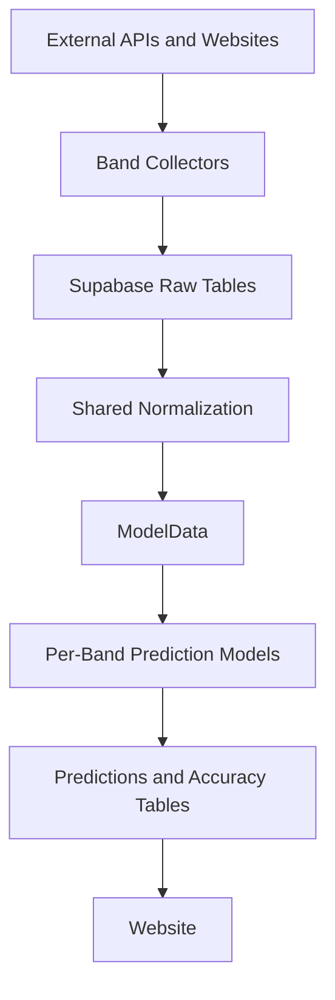

# Architecture Overview

This document provides the high-level system view. For the canonical ingestion,
storage, sequencing, and prediction contract, use the
[Data Strategy](../../reference/specifications/data_strategy.md) document.

## Overview

JamBandNerd is a show-centric data platform for jam band setlist collection,
normalization, prediction, and evaluation. The public product is a website-first
experience at [jambandnerd.com](https://jambandnerd.com), backed by Supabase and
the consolidated Python pipeline. v1.0.1 shipped to production on 2026-05-23.

## System Flow

## Layers

### Collection

- Band-specific collectors handle source quirks and write to raw tables.
- The standard raw families are `{band}_shows_raw`, `{band}_setlists_raw`, and
  `{band}_songs_raw`.
- Supporting tables such as venues or upcoming shows are allowed when the
  source requires them.
- WSP remains a special-case collector because CI reliability can require
  browser automation.

### Normalization and Transformations

- Shared code does not model directly from source-specific raw payloads.
- The normalization boundary in `scripts/common.py` and
  `src/jambandnerd/transformations/gaps.py` aligns bands onto a shared contract.
- Historical ordering is deterministic: `show_date` first, then a stable
  secondary key.
- All downstream feature generation remains in memory; no intermediate
  transformed Supabase tables are allowed.

### Models and Evaluation

The platform runs **one precision-optimized model per band** (ADR 0001, complete).
See [ADR 0001](../../contributor/adr/0001-single-model-per-band.md) for the full
decision record.

- `ModelData` is the canonical handoff from transforms into models. It remains
  shared across all band models.
- Each band has exactly one promoted predictor class under
  `src/jambandnerd/models/{band}/`, implementing the `PredictionModel` ABC.
  Architectures may differ across bands.
- All models respect the `reference_date` anti-leakage rule.
- **Phase B promotion metric**: F1@25 is the primary offline promotion signal
  because precision@25 is capped by actual setlist size. Precision@25 remains
  the product-facing board accuracy metric and a non-regression guardrail.
- `setlist_accuracy` is the canonical evaluation table, keyed
  `(band, model_version, target_show_key)`, retained to the last 50 eligible
  completed shows per band.
- Legacy tables (`completed_show_accuracy`, `accuracy_per_show`,
  `historical_prediction_runs`) exist in Supabase but receive no new writes
  from the active pipeline.

### Delivery

- The website at `apps/web` is the live public product surface (`jambandnerd.com`).
- Supabase is the shared storage and read layer for predictions and accuracy data.
- Domain-specific data modules live in `apps/web/src/lib/data/{bands,predictions,accuracy,shows}.ts`.
- Route files compose server-side results; they do not reimplement query logic.
- Client components are reserved for interactive islands, navigation hooks, and live subscriptions.

Live website routes:
- `/` — Homepage with band overview and teaser predictions
- `/predictions` — Live single-model prediction board with show outlook
- `/performance` — Historical accuracy charts with K-value selection
- `/replay` — Single-model historical replay of a past prediction against the actual setlist
- `/last-show` — Most recent completed show details (secondary route, not in primary nav)
- `/about`, `/contact`, `/data-use` — Public informational pages

Removed routes (multi-model era):
- `/compare` — Multi-model head-to-head board (removed; one model per band)
- `/explorer` — Compatibility redirect to `/compare` (removed with `/compare`)

Key shared components:
- `page-hero`, `site-header`, `site-footer`, `dashboard-side-nav`
- `prediction-hero`, `song-board`, `recall-chart`, `accuracy-table`
- `show-outlook-popover`, `live-tracker`

### Orchestration

- GitHub Actions YAML is the canonical daily orchestration surface.
- `scripts/run_optimized_pipeline.py` is a local helper that mirrors the daily
  workflow sequence for repo-supported bands.
- Pull requests targeting `main` should clear `Repo Quality` and `Verify Website` before merge.
- Workflow band support is repo-authoritative via `src/jambandnerd/config/bands.py`.
- Band metadata (slug, display name, raw table names, ID column) is managed in the
  `bands` Supabase table for runtime consumers such as the website. Adding a
  new band requires both updating the repo band config and inserting a row into
  `bands`.
- Supported bands: Goose, Phish, Eggy, Billy Strings, Widespread Panic, Umphrey's McGee

### Model Platform

The model platform is registry-based and ships one model per band in production.
See [ADR 0001](../../contributor/adr/0001-single-model-per-band.md) for the
full decision record.

The backend model platform is registry-based. The canonical source of truth is
`src/jambandnerd/models/registry.py`, keyed by **band slug** — one registered
model per supported band. Each entry carries `band`, `model_version`, lifecycle
flags, and `default_top_k`.

Per-band predictor classes live under `src/jambandnerd/models/{band}/` and
implement `PredictionModel` from `src/jambandnerd/models/base.py`. Legacy
multi-model classes (Notebook, Deal, CK+) are archived in
`src/jambandnerd/models/legacy/` for offline reference only; they are not
registered production predictors.

Billy's accepted baseline is `BillyFastBaselinePredictor`, an alias for
`BillyFastPredictorV10` with model version `billy_fast_gbm_v10_hp_tuned`. V3
remains the feature-family base, while V4, V5, V6, and the V10 experiment
subclasses remain importable experiment classes but are not registered
production predictors.

Adding or updating a per-band model:
1. Implement `PredictionModel` in `src/jambandnerd/models/{band}/model.py`.
2. Update the band's registry entry with a new `model_version`.
3. Run `scripts/run_backtest.py --band {band}` and compare against the
   incumbent metrics in the session logs.
4. Promote once the per-band gate is met (see ADR 0001).

Live model runs write to `setlist_predictions` and `setlist_prediction_songs`.
Completed-show evaluation writes to `setlist_results` and `setlist_accuracy`.

## Non-Negotiable Rules

- **Shared infra stays band-agnostic**: `ModelData`, `PredictionModel` ABC,
  training/eval harness, storage contract, and CI scaffolding are shared.
  Per-band predictor classes belong in `src/jambandnerd/models/{band}/`.
- Collector-specific logic belongs in the collector and config layers.
- `reference_date` must gate all transforms and backtests.
- New data architecture work must preserve the two-stage contract:
  source-faithful raw storage, shared normalized modeling inputs.
- Band metadata lives in the `bands` Supabase table — the website reads it
  dynamically. Do not hardcode band lists in frontend code.
- Backend model registration lives in `models/registry.py`. There is no
  frontend model-picker — the website reads the registered band model output
  from `setlist_*` tables.
